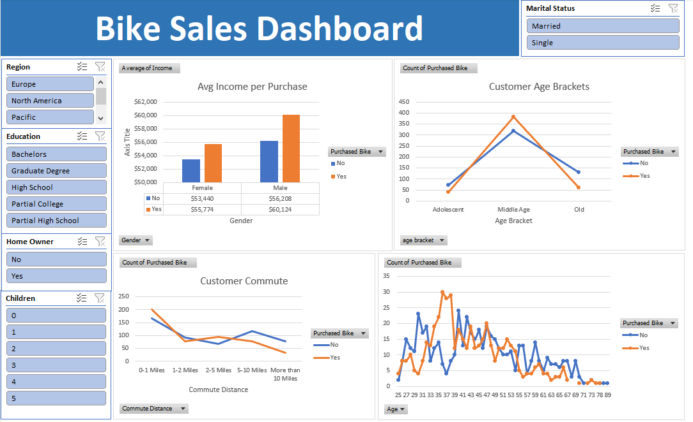
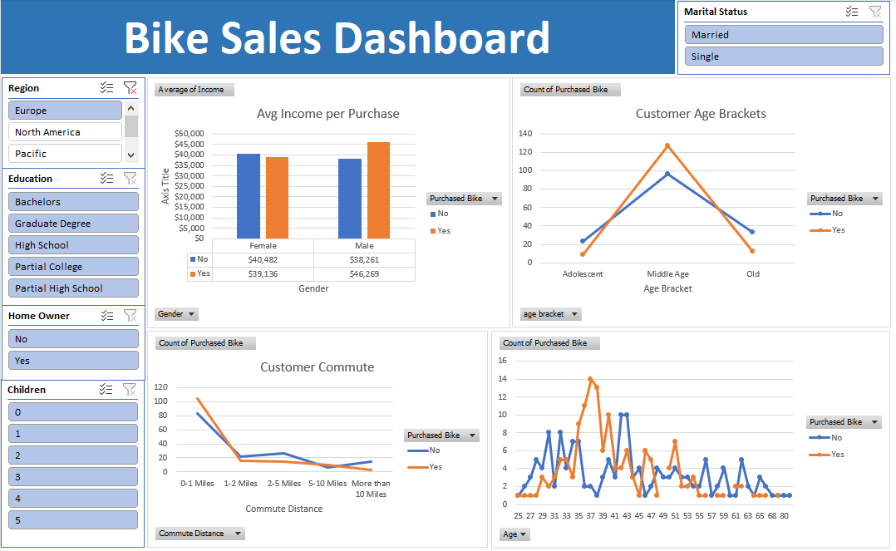
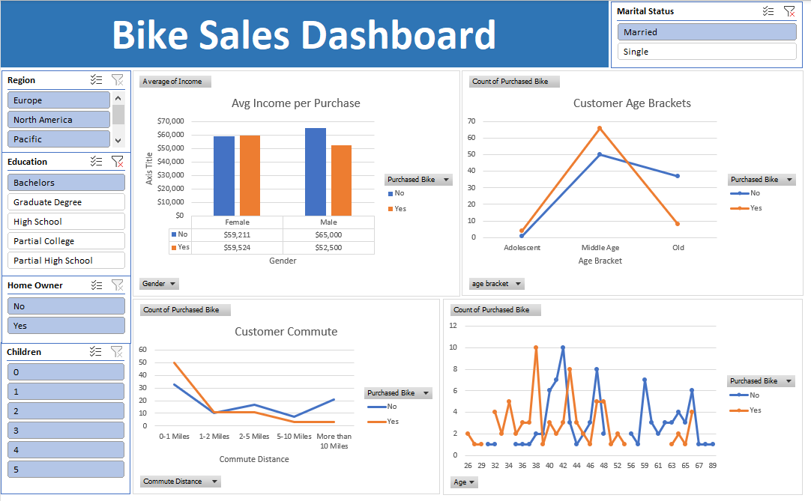

# Excel Data Analytics Project: Bike Sales Analysis Dashboard

This project is a comprehensive data analytics case study involving the cleaning, processing, and visualization of a bike sales dataset. Following the workflow of the "Alex The Analyst" tutorial, I transformed raw demographic data into an interactive business dashboard.

## 📂 Project Overview
The goal of this analysis was to identify the key demographic drivers behind bike purchases. By analyzing factors such as income, age, and commute distance, this dashboard provides actionable insights into customer behavior.

## 📊 Dashboard Preview

## 🛠️ Data Cleaning & Transformation
Before building the visualizations, I performed extensive data cleaning to ensure accuracy:
* **Duplicate Removal:** Identified and removed 26 duplicate rows to prevent skewed results. [00:03:36]
* **Standardization:** Used 'Find and Replace' to convert shorthand values (M/S, M/F) into readable categories (Married/Single, Male/Female) for better user experience. [00:04:16]
* **Data Formatting:** Converted income data into Currency format and standardized commute distances. [00:05:39]
* **Custom Age Bracketing:** Developed a nested `IF` statement to bucket ages into three categories: **Adolescent (<31)**, **Middle Age (31-54)**, and **Old (55+)**. This significantly improved the clarity of the age-based trends. [00:12:12]

## 📈 Key Insights & Visualizations
1. **Average Income per Purchase:** Discovered that customers who purchased bikes had a higher average income than those who did not, with males generally having a higher income profile in this dataset. [00:15:28]
2. **Customer Commute Trends:** Analyzed the relationship between commute distance and purchase likelihood, revealing that shorter commutes often correlate with higher bike sales. [00:23:53]
3. **Customer Age Brackets:** Identified that the "Middle Age" bracket (31-54) is the primary demographic for bike sales, far outpacing adolescents and seniors. [00:25:41]

## 🧩 Interactive Features
* **Dynamic Slicers:** Implemented interactive filters for **Marital Status**, **Region**, and **Education**, allowing users to "slice and dice" the data to see how specific sub-groups behave. [00:36:01]
* **Report Connections:** Linked all slicers to multiple pivot charts to ensure a cohesive and synchronized dashboard experience. [00:38:24]

## 🧠 Skills Demonstrated
* **Advanced Excel Formulas:** Nested IF statements for data bucketing.
* **Data Cleaning:** Duplicate removal, Find/Replace, and data type standardization.
* **Pivot Tables:** Data aggregation and multi-dimensional analysis.
* **Dashboard Design:** UI/UX principles, color coordination, and interactive slicers.

---

## 📁 Repository Structure
* `Bike_Sales_Analysis_Dashboard.xlsx`: The final interactive Excel workbook.
* `/images/`: Screenshots of the final dashboard and key analysis steps.

## 📝 Acknowledgments
Special thanks to **Alex The Analyst** for providing the dataset and the foundational tutorial for this project.

---
### Contact & Connect
* **LinkedIn:** [Aymen Djemoui](https://www.linkedin.com/in/ayman-djemoui-249286126/)
* **GitHub Portfolio:** [ayman4data](https://github.com/ayman4data)
